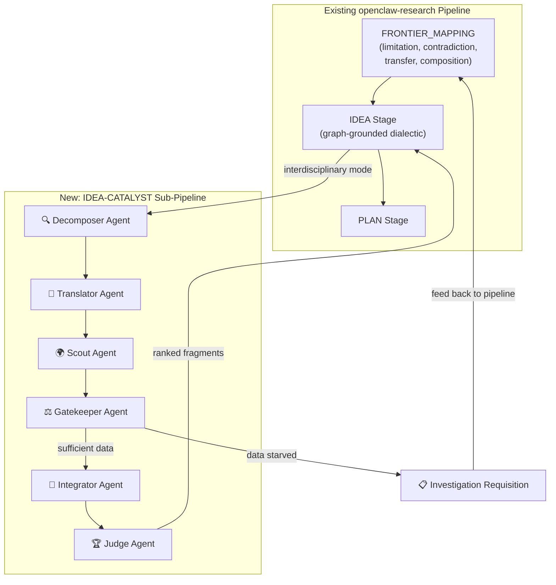
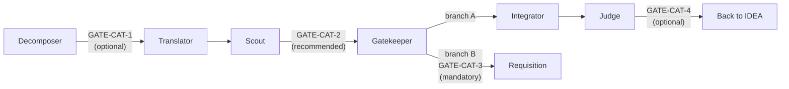

# IDEA-CATALYST Multi-Agent Blueprint
## Architectural Gap Analysis & Expansion Plan

> **Role**: Chief AI Architect & Lead Research Scientist
> **Date**: 2026-04-02
> **Scope**: Deep analysis of the IDEA-CATALYST paper (2603.12226v1) vs. current implementation, PaperNexus KG capabilities, and openclaw-research multi-agent architecture.

---

## Executive Summary

The current `pn_idea_catalyst.py` implements **the skeleton** of the IDEA-CATALYST pipeline but misses the paper's core intellectual machinery. The paper's power comes not from the 5 steps themselves — which are almost obvious — but from the **metacognitive control layer** that governs *when and how* each step fires. We are currently faking three critical capabilities: analogical reasoning for domain selection, dual-formulation abstraction depth, and pairwise interdisciplinary potential ranking. This report maps every gap, proposes KG-level solutions, and designs a multi-agent expansion that integrates IDEA-CATALYST philosophy into the existing openclaw-research pipeline as a new **IDEATION sub-pipeline** within the existing `IDEA` stage.

---

## Area 1: Gap Analysis of the Current Workflow

### 1.1 The Paper's Actual Architecture (What People Miss)

The paper is **not** a 5-step linear pipeline. It is a **metacognition-driven control loop** built on four cognitive behaviors:

| Metacognitive Behavior | Paper's Implementation | Our Implementation |
|------------------------|----------------------|-------------------|
| **Self-awareness** | Decompose p → assess which facets are resolved/partial/unexplored via literature retrieval | ✅ Phase 0 does this via KG queries — but coarsely |
| **Context-awareness** | Recognize target-domain assumptions, constraints, norms; identify what's *implicitly* limiting | ❌ We don't extract constraints or norms from KG nodes |
| **Strategy selection** | Choose *which* external disciplines to explore based on the *nature* of the challenge (formalization → control theory; behavior → psychology) | ❌ We ask the LLM to guess — no structural reasoning |
| **Goal management** | Maintain intermediate objectives; prioritize questions by "greatest potential for conceptual advancement" | ⚠️ Partial — we identify one unresolved challenge but don't rank multiple |
| **Evaluation** | Pairwise comparison of interdisciplinary potential across all fragments | ❌ We use scalar LLM scores, not comparative ranking |

### 1.2 Step-by-Step Honest Assessment

#### Step 1: Problem Decomposition → ⚠️ PARTIALLY IMPLEMENTED

**What the paper does:**
- Decomposes p into research questions Q = {q₁, q₂, ...}
- Each qᵢ has **dual representation**: domain-specific (q^D_i) AND domain-agnostic (q'_i)
- Generates search queries per q^D_i, retrieves target-domain papers, evaluates coverage as `resolved | partial | unexplored`
- Surfaces *remaining critical non-incremental challenges* q^i_j for each partially-addressed question

**What we're doing:**
- Single LLM call to decompose into questions ✅
- Dual representation generated in the same prompt ✅
- Query KG for coverage ✅
- Identify ONE unresolved challenge ⚠️ (paper identifies multiple, per-question)

**Honest verdict:** We decompose, but we don't **evaluate coverage rigorously**. The paper retrieves papers per-question and runs a structured relevance assessment. We do a bulk KG search and ask the LLM to eyeball it. The difference matters because the paper's per-question coverage assessment is what drives which questions go to Phase 2 (only `unexplored` and `partial` ones).

> [!WARNING]
> **Critical gap**: We skip the coverage classification (`resolved | partial | unexplored`) entirely. This means we cannot prioritize which challenges to send to cross-domain exploration. We just pick the "top" one.

#### Step 2: Domain-Agnostic Abstraction → ⚠️ WEAK

**What the paper does:**
- The dual representation (q^D_i, q'_i) is generated **during decomposition**, not as a separate phase
- The domain-agnostic form is carefully designed to "isolate the underlying conceptual gaps that remain unresolved" and "correspond to theoretical constructs, explanatory frameworks, or empirical phenomena studied in external fields"
- Example quality: "How can a system adapt in real-time to high inter/intra-user variability?" → "How can behavior adapt to diverse collaborators & evolving goals/environments?"

**What we're doing:**
- Phase 1 in our script just re-packages what Phase 0 already generated
- The LLM is asked to "strip jargon" but there's no structural constraint ensuring the abstraction captures the **mechanism** vs. just simplifying the vocabulary

**Honest verdict:** Our "abstraction" is vocabulary simplification, not conceptual abstraction. The paper's abstractions are designed to be *structurally matchable* to other domains' frameworks. Ours are just simpler English.

#### Step 3: Cross-Domain Matchmaking → ❌ FAKING IT

**What the paper does:**
- Selects source domains based on three explicit criteria:
  1. **Analogy** (structural similarity of problems across domains)
  2. **Shared mechanisms** (common underlying processes)
  3. **Transferable principles** (general frameworks)
- **Explicitly excludes** proximal domains using a coarse-grained distance metric
- Generates domain-specific search queries in the **vocabulary of the source domain** (e.g., "cognitive load theory" for Psychology, not ML jargon)
- Prunes domains where >50% of retrieved papers are irrelevant

**What we're doing:**
- Ask the LLM: "Select 3 external source domains" with a prompt listing the three criteria
- LLM "selects" based on its parametric knowledge — this is **exactly the Free-Form Source Retrieval baseline** that the paper shows performs 282% worse than IDEA-CATALYST
- No domain distance metric
- No pruning of domains with low-relevance retrieval

**Honest verdict:** This is the most critical failure. We are implementing the **worst baseline** from the paper and calling it IDEA-CATALYST.

> [!CAUTION]
> **The LLM cannot reliably do analogical reasoning for domain selection.** The paper's own results (Figure 3) show that unconstrained LLM domain selection exhibits "severe skew toward Computer Science (947 occurrences)" with normalized entropy H_norm = 0.326. The paper achieves H_norm = 0.682 through structured metacognitive guidance, not better prompting.

#### Step 4: Recontextualization → ⚠️ SURFACE-LEVEL

**What the paper does:**
- For each eligible (qᵢ, D_s) pair, integrates source-domain takeaways with target-domain literature
- Integration is guided by three structural considerations:
  1. How target methods can be *complemented* by source perspectives
  2. How the combined view addresses the *specific challenge*
  3. How limitations of either domain are *mitigated through synthesis*
- Output is a structured **idea fragment** with explicit `integration_mechanism`, `challenge_resolution`, and `concrete_realization` fields

**What we're doing:**
- Single LLM prompt asking "generate TOP 3 idea fragments"
- No structural integration constraints
- No explicit challenge-resolution mapping

**Honest verdict:** We synthesize, but without structure. The paper's idea fragments are carefully designed intermediate representations, not just "ideas."

#### Step 5: Ranking → ❌ WRONG APPROACH

**What the paper does:**
- **Pairwise comparison** between all idea fragments
- Ranks by "interdisciplinary potential" — a multi-dimensional concept covering depth of integration, multi-stage disciplinary engagement, innovation payoff, and novelty-feasibility balance
- Uses a separate LLM judge with detailed evaluation prompts (Appendix E)
- Ablation shows removing this ranking degrades performance significantly

**What we're doing:**
- Scalar `novelty_score` and `usefulness_score` from the generating LLM itself
- No pairwise comparison
- No separate evaluator

**Honest verdict:** We score ideas like a homework grading rubric. The paper ranks ideas like a debate tournament. These are fundamentally different epistemologies.

### 1.3 Summary Scorecard

| Step | Paper's Approach | Our Status | Gap Severity |
|------|-----------------|-----------|-------------|
| 1. Decomposition | Multi-question, per-Q coverage assessment | Bulk decomposition, single-challenge selection | 🟡 Medium |
| 2. Abstraction | Mechanism-capturing dual formulation | Vocabulary simplification | 🟡 Medium |
| 3. Matchmaking | Structure-guided cross-domain selection | LLM guessing (= worst baseline) | 🔴 Critical |
| 4. Recontextualization | Structured integration with 3-point synthesis | Single prompt generation | 🟡 Medium |
| 5. Ranking | Pairwise interdisciplinary potential | Scalar self-scores | 🔴 Critical |
| Meta: Control | Metacognitive monitoring at each step | None — linear pipeline | 🔴 Critical |

---

## Area 2: Enhancing the KG & Matchmaking

### 2.1 Current KG Capabilities vs. Requirements

The PaperNexus KG has **more relational depth than the paper's system** (which uses Semantic Scholar snippets as a black box). But we're not exploiting it.

**What we have (PaperNexus schema):**
```
Node types: Corpus, Paper, Problem, Claim, Finding, Method, Dataset,
            Benchmark, Metric, Limitation, Assumption, Evidence,
            FutureDirection, ResearchGoal

Edge types: SOLVES, USES, APPLIES_TO, TRANSFERABLE_TO, COMBINES_WITH,
            COMPATIBLE_WITH, MAY_BE_ADDRESSED_BY, RELATED_TO, SIMILAR_TO,
            CONTRADICTS, HAS_LIMITATION, ASSUMES, DEPENDS_ON, REQUIRES,
            FAILS_UNDER, HAS_GAP, LEADS_TO, BLOCKED_BY, ...

Brainstorm infrastructure: Community detection (Leiden), boundary nodes,
            cross-community bridges, latent neighbors, method combinations
```

**What we need but don't have:**

#### 2.1.1 Domain/Field Tagging

> [!IMPORTANT]
> The KG currently has **no concept of "domain" or "scientific field"**. Papers have no `field` property. Nodes have no `domain` annotation. This makes cross-domain matchmaking structurally impossible at the graph level.

**Solution: Domain Layer**

Add a new node type or property:
```
NODE_TYPES.DOMAIN = 'Domain'  (or use a property on Paper nodes)

New edges:
  Paper → BELONGS_TO → Domain
  Problem → STUDIED_IN → Domain
  Method → ORIGINATED_IN → Domain
```

This can be populated:
- During LLM extraction (add "field of study" to the semantic extraction prompt)
- Retroactively via a batch classification pass on existing papers
- From external metadata (arXiv categories, S2 fields of study)

#### 2.1.2 Mechanism Abstraction Nodes

The paper's key insight is that "Catastrophic Forgetting" (CS) and "Memory Consolidation" (Neuroscience) share an **underlying mechanism**: "How to preserve old knowledge while integrating new knowledge in a learning system."

The current KG cannot represent this because:
- Problems are domain-specific text strings
- There's no "abstract mechanism" layer connecting problems across domains
- The `SIMILAR_TO` edge exists but operates on surface-level name similarity (Jaccard), not conceptual similarity

**Solution: Abstract Mechanism Layer**

```
New node type: AbstractMechanism
  Properties: description, mechanism_type (adaptation, preservation,
              coordination, optimization, ...)

New edges:
  Problem → INSTANTIATES → AbstractMechanism
  Method  → IMPLEMENTS  → AbstractMechanism
  Limitation → CONSTRAINS → AbstractMechanism
```

This creates a **domain-agnostic bridge layer** that the matchmaking agent can traverse:

```
Query: "What mechanisms are similar to 'catastrophic forgetting'?"

Graph traversal:
  CatastrophicForgetting (Problem, CS)
    → INSTANTIATES → MemoryPreservation (AbstractMechanism)
    ← INSTANTIATES ← MemoryConsolidation (Problem, Neuroscience)
    ← INSTANTIATES ← HabitatPreservation (Problem, Ecology)
```

#### 2.1.3 Cross-Domain Bridge Queries

Currently, `brainstorm-communities.js` detects communities and finds cross-community bridges. But communities are formed by **co-occurrence in papers**, not by **conceptual similarity across domains**.

**Solution: Cross-Domain Query Algorithm**

```
Given: abstract_challenge (domain-agnostic string)
       target_domain (to exclude)

Algorithm:
  1. Embed abstract_challenge into the same vector space as KG node names
  2. Find top-K nodes across ALL domains where:
     - cosine_similarity(abstract_challenge, node.name) > threshold
     - node.domain ≠ target_domain
     - node.type ∈ {Problem, Method, Limitation, Assumption}
  3. For each candidate node, compute "domain distance":
     - distance = 1 - jaccard(target_domain.method_set, candidate_domain.method_set)
     - Prefer higher distance (more distant domains)
  4. Return ranked candidates grouped by source domain
```

This requires adding a **vector index** over node names/descriptions (potentially using the existing `write-index` pipeline stage).

#### 2.1.4 Analogy Detection via Structural Isomorphism

The most powerful enhancement would be **structural analogy detection**: finding subgraph patterns in domain A that are isomorphic to patterns in domain B.

```
Domain A (CS):
  ProblemA →(HAS_LIMITATION)→ LimitationA →(MAY_BE_ADDRESSED_BY)→ MethodA

Domain B (Biology):
  ProblemB →(HAS_LIMITATION)→ LimitationB →(MAY_BE_ADDRESSED_BY)→ MethodB

If ProblemA.abstract ≈ ProblemB.abstract:
  → MethodB is an analogical candidate for ProblemA
```

This is computationally expensive but could be approximated using the existing community detection + bridge infrastructure by treating cross-domain community bridges as analogy candidates.

### 2.2 KG Enhancement Roadmap

| Priority | Enhancement | Implementation Effort | Impact on Matchmaking |
|----------|------------|----------------------|----------------------|
| P0 | Domain tagging on Paper/Problem/Method nodes | Low (batch LLM pass) | Enables domain filtering |
| P0 | Domain distance metric (field co-occurrence matrix) | Low (compute from tagged data) | Enables "far enough" enforcement |
| P1 | Abstract mechanism nodes + INSTANTIATES edges | Medium (extraction prompt change + backfill) | Enables true analogical bridging |
| P1 | Vector index over node descriptions | Medium (embedding pipeline) | Enables semantic cross-domain search |
| P2 | Structural analogy detection | High (subgraph matching algorithm) | Enables deep analogical reasoning |
| P2 | Automated domain-agnostic reformulation of Problem nodes | Medium (batch LLM) | Pre-computes dual representations |

---

## Area 3: Multi-Agent Research Pipeline Blueprint

### 3.1 Integration Strategy: IDEA-CATALYST as a Sub-Pipeline Inside `IDEA` Stage

The existing openclaw-research pipeline already has a sophisticated `IDEA` stage with `FRONTIER_MAPPING` → `IDEA` flow. Rather than creating a parallel system, IDEA-CATALYST should become a **new micro-stage sequence within IDEA**, activated when the user requests interdisciplinary ideation.



### 3.2 Agent Specifications

#### Agent 1: 🔍 **Decomposer Agent** (Target-Domain Critical Reasoning)

| Property | Value |
|----------|-------|
| **Owner** | Researcher (spawned sub-agent) |
| **Metacognitive role** | Self-awareness + Goal management |
| **Inputs** | Research problem p, target domain D_target, PaperNexus graph access |
| **Outputs** | `DECOMPOSITION_PACKET.json` |

**Responsibilities:**
1. Decompose p into N research questions Q = {q₁, ..., qₙ}
2. For each qᵢ, generate dual representation (q^D_i, q'_i)
3. For each q^D_i, generate search queries and run them against the KG
4. Classify each qᵢ as `resolved | partial | unexplored` based on KG coverage
5. For `partial` questions, extract remaining critical challenges q^i_j with dual representation
6. **Priority-rank** questions: unexplored > partial challenges > resolved questions

**KG API calls:**
- `POST /api/query` — per q^D_i search queries
- `POST /api/context` — per matched node neighborhood
- `POST /api/brainstorm` — diverge mode for coverage assessment

**Output schema:**
```json
{
  "problem": "...",
  "target_domain": "...",
  "questions": [
    {
      "id": "q1",
      "domain_specific": "...",
      "domain_agnostic": "...",
      "coverage": "partial",
      "kg_evidence": ["node-id-1", "node-id-2"],
      "remaining_challenges": [
        {
          "id": "q1_1",
          "domain_specific": "...",
          "domain_agnostic": "...",
          "priority_score": 0.85
        }
      ]
    }
  ],
  "selected_challenges": ["q1_1", "q2_3"],
  "coverage_summary": "..."
}
```

**Human-in-the-loop gate:** OPTIONAL — show decomposition to user for validation before expensive cross-domain search. User can modify/add/remove questions.

---

#### Agent 2: 🔄 **Translator Agent** (Domain-Agnostic Abstraction Quality Control)

| Property | Value |
|----------|-------|
| **Owner** | Researcher (spawned sub-agent) |
| **Metacognitive role** | Context-awareness |
| **Inputs** | `DECOMPOSITION_PACKET.json` |
| **Outputs** | `ABSTRACTION_PACKET.json` |

**Responsibilities:**
1. **Quality-check** each domain-agnostic formulation q'_i from the Decomposer
2. Ensure abstractions capture the **mechanism**, not just simplified vocabulary:
   - Bad: "How to prevent forgetting in AI" (still domain-specific)
   - Good: "How to preserve old patterns while integrating new ones in a learning system" (mechanism-level)
3. For each selected challenge, generate a **mechanism signature**: 2-3 keywords describing the abstract mechanism (e.g., `[preservation, integration, learning]`)
4. If the KG has AbstractMechanism nodes (P1 enhancement), resolve the mechanism signature to existing graph nodes

**Why a separate agent?** The Decomposer is biased toward the target domain's framing. The Translator must be able to "forget" the domain and think in purely structural/functional terms. Separating them prevents the abstraction from being contaminated by domain assumptions.

**Output schema:**
```json
{
  "challenges": [
    {
      "id": "q1_1",
      "original_domain_specific": "...",
      "refined_domain_agnostic": "...",
      "mechanism_signature": ["preservation", "integration", "incremental"],
      "resolved_mechanism_nodes": ["abstract-mech-id-1"],
      "abstraction_quality": "mechanism_level | vocabulary_level | too_abstract"
    }
  ]
}
```

---

#### Agent 3: 🌍 **Scout Agent** (Cross-Domain Creative Exploration)

| Property | Value |
|----------|-------|
| **Owner** | Researcher (spawned sub-agent) |
| **Metacognitive role** | Strategy selection |
| **Inputs** | `ABSTRACTION_PACKET.json`, KG graph access |
| **Outputs** | `SCOUTING_REPORT.json` |

**Responsibilities:**
1. **Domain selection** — NOT by asking the LLM to guess, but through structural methods:
   - If AbstractMechanism nodes exist: traverse `INSTANTIATES` edges to find Problems/Methods in other domains
   - If domain tagging exists: find domains with high structural analogy scores
   - If vector index exists: find cross-domain nodes semantically similar to the mechanism signature
   - Fallback: LLM-assisted selection with strict distance enforcement
2. **Domain distance enforcement** — compute and enforce minimum distance from target domain
3. **Source-domain query generation** — generate queries in the **vocabulary of the source domain** (the LLM must think *as* a psychologist, not *about* psychology)
4. **Retrieval + Relevance pruning** — retrieve from KG, prune domains where >50% of nodes are irrelevant

**This is the hardest agent to implement well.** The paper's entire advantage over baselines comes from this step being structure-guided rather than LLM-intuition-guided.

**KG API calls:**
- `POST /api/query` — per source-domain search query
- `POST /api/context` — per matched cross-domain node
- `POST /api/impact` — trace upstream/downstream from cross-domain nodes
- Cross-domain bridge queries (NEW, requires P0/P1 KG enhancements)

**Output schema:**
```json
{
  "scouted_domains": [
    {
      "domain": "Psychology",
      "distance_score": 0.78,
      "selection_basis": "shared_mechanisms",
      "rationale": "...",
      "queries_generated": ["cognitive load theory", "role adaptation"],
      "retrieved_nodes": [...],
      "relevance_ratio": 0.72,
      "pruned": false,
      "takeaways": [
        {
          "id": "t1",
          "concept": "Metacontrol State Model",
          "mechanism": "Dynamic regulation between persistence and flexibility",
          "source_papers": ["paper-title-from-kg"],
          "kg_node_ids": ["node-id-1"]
        }
      ]
    }
  ]
}
```

**Human-in-the-loop gate:** RECOMMENDED — show selected source domains and initial takeaways to user. User can veto irrelevant domains or suggest additional ones they know about.

---

#### Agent 4: ⚖️ **Gatekeeper Agent** (Data Sufficiency Evaluation)

| Property | Value |
|----------|-------|
| **Owner** | Researcher (spawned sub-agent) |
| **Metacognitive role** | Evaluation |
| **Inputs** | `SCOUTING_REPORT.json` |
| **Outputs** | `GATE_DECISION.json` — either proceed or halt |

**Responsibilities:**
1. Apply the data sufficiency threshold: ≥1 domain with ≥3 relevant conceptual nodes
2. **Quality assessment** of takeaways: are they genuinely insightful or just surface-level matches?
3. Make the binary decision: BRAINSTORM or INVESTIGATION_REQUISITION
4. If halting: generate a structured requisition with exact search queries for paper acquisition

**This agent is the "Data Evaluator" from the original brain_storm.md plan.** It must be incorruptible — it cannot be "talked into" proceeding when data is insufficient.

**Output schema:**
```json
{
  "decision": "BRAINSTORM | INVESTIGATION_REQUISITION",
  "evidence": {
    "sufficient_domains": ["Psychology"],
    "insufficient_domains": ["Economics", "Biology"],
    "total_relevant_nodes": 7,
    "threshold_met": true
  },
  "requisition": null | { ... }
}
```

---

#### Agent 5: 🧬 **Integrator Agent** (Target–Source Synthesis)

| Property | Value |
|----------|-------|
| **Owner** | Researcher (spawned sub-agent) |
| **Metacognitive role** | Creative synthesis |
| **Inputs** | `SCOUTING_REPORT.json`, `DECOMPOSITION_PACKET.json` |
| **Outputs** | `IDEA_FRAGMENTS.json` |

**Responsibilities:**
1. For each eligible (challenge, source_domain) pair, generate an idea fragment
2. Apply the paper's three integration constraints:
   - How target-domain methods can be *complemented*
   - How the combined view addresses the *specific challenge*
   - How limitations of either domain are *mitigated*
3. Output structured idea fragments with `integration_mechanism`, `challenge_resolution`, and `concrete_realization`
4. Generate ALL fragments before any ranking — don't self-censor during generation

**Output schema:** Uses the paper's exact Idea Fragment Format (Appendix A):
```json
{
  "fragments": [
    {
      "id": "f1",
      "title": "...",
      "core_insight": "...",
      "integration_mechanism": {
        "target_domain_elements": [...],
        "selected_takeaways": [...],
        "synthesis_approach": "..."
      },
      "challenge_resolution": {
        "addresses_target_challenge": "...",
        "addresses_source_limitations": "...",
        "addresses_research_problem": "..."
      },
      "concrete_realization": {
        "proposed_approach": "...",
        "key_innovations": [...]
      }
    }
  ]
}
```

---

#### Agent 6: 🏆 **Judge Agent** (Interdisciplinary Potential Ranking)

| Property | Value |
|----------|-------|
| **Owner** | Reviewer (or dedicated evaluator sub-agent) |
| **Metacognitive role** | Evaluation (independent) |
| **Inputs** | `IDEA_FRAGMENTS.json`, original problem p |
| **Outputs** | `RANKED_FRAGMENTS.json` |

**Responsibilities:**
1. Conduct **pairwise comparisons** between all idea fragments
2. Use the paper's exact evaluation criteria:
   - Interdisciplinary **novelty** (source domain distance, non-obvious integration)
   - Interdisciplinary **usefulness** (potential impact, gap-addressing ability)
3. Aggregate pairwise preferences into a ranked ordering
4. **MUST be a different LLM call / different prompt persona than the Integrator** — the generator cannot judge its own output

**Critical design decision:** The Judge must NOT see individual scalar scores. It must compare fragments pairwise, as the paper does. This avoids anchor bias and produces more reliable rankings.

**Pairwise comparison count:** For K fragments, need K*(K-1)/2 comparisons. With K=6 fragments, that's 15 LLM calls — acceptable.

**Output schema:**
```json
{
  "ranking": [
    {
      "fragment_id": "f3",
      "rank": 1,
      "wins": 4,
      "losses": 1,
      "elo_score": 1520,
      "novelty_wins": 3,
      "usefulness_wins": 4
    }
  ],
  "pairwise_results": [
    {
      "fragment_a": "f1",
      "fragment_b": "f3",
      "novelty_winner": "f3",
      "usefulness_winner": "f3",
      "overall_winner": "f3",
      "reasoning": "..."
    }
  ]
}
```

### 3.3 Communication Protocol

#### 3.3.1 Inter-Agent Communication via Durable Artifacts

Following the existing openclaw-research pattern, agents communicate through **durable JSON/Markdown files**, not in-memory message passing:

```
{PROJ}/researcher/idea-catalyst/
├── DECOMPOSITION_PACKET.json          ← Decomposer → Translator, Scout
├── ABSTRACTION_PACKET.json            ← Translator → Scout
├── SCOUTING_REPORT.json               ← Scout → Gatekeeper, Integrator
├── GATE_DECISION.json                 ← Gatekeeper → Integrator or Pipeline
├── IDEA_FRAGMENTS.json                ← Integrator → Judge
├── RANKED_FRAGMENTS.json              ← Judge → Researcher
├── INVESTIGATION_REQUISITION.json     ← Gatekeeper → Pipeline (if data-starved)
└── CATALYST_SESSION_STATE.json        ← Session state for restart recovery
```

#### 3.3.2 Spawn Chain

```
Researcher (IDEA stage, interdisciplinary mode)
  ├─► spawn Decomposer → wait for DECOMPOSITION_PACKET.json
  ├─► spawn Translator → wait for ABSTRACTION_PACKET.json
  ├─► spawn Scout → wait for SCOUTING_REPORT.json
  ├─► spawn Gatekeeper → wait for GATE_DECISION.json
  │     ├─► if BRAINSTORM: spawn Integrator → spawn Judge
  │     └─► if REQUISITION: emit INVESTIGATION_REQUISITION.json → stop
  ├─► read RANKED_FRAGMENTS.json
  └─► merge top-ranked fragments into IDEA_REPORT.md as tracks
```

#### 3.3.3 State Machine Integration

Add new micro-stages to the existing `IDEA` stage micro-stage map:

```
IDEA micro-stages (augmented):
  graph_diverge_complete
  graph_converge_complete
  ── NEW ──
  catalyst_decomposition_complete      ← after Decomposer
  catalyst_abstraction_complete        ← after Translator
  catalyst_scouting_complete           ← after Scout
  catalyst_gate_passed                 ← after Gatekeeper (branch A)
  catalyst_requisition_emitted         ← after Gatekeeper (branch B)
  catalyst_fragments_generated         ← after Integrator
  catalyst_fragments_ranked            ← after Judge
  ── END NEW ──
  innovation_construction_complete
  duplicate_risk_checked
  attacker_pass_complete
  novelty_checked
  idea_audited
  portfolio_selected
```

### 3.4 Human-in-the-Loop Validation Gates



| Gate | Type | Purpose | User Action |
|------|------|---------|------------|
| **GATE-CAT-1** | Optional | Review decomposition questions and coverage assessment | Add/remove/modify questions |
| **GATE-CAT-2** | Recommended | Review selected source domains and initial takeaways | Veto irrelevant domains, suggest better ones |
| **GATE-CAT-3** | Mandatory | Review investigation requisition before data ingestion | Approve/modify ingestion plan |
| **GATE-CAT-4** | Optional | Review ranked idea fragments before portfolio integration | Override ranking, discard weak fragments |

When `AUTO_PROCEED=true`, only GATE-CAT-3 pauses (because data ingestion has real cost).

### 3.5 Integration with Existing Pipeline Components

#### 3.5.1 Feeding into Track Registry

The Judge's top-ranked fragments become **candidate tracks** in `TRACK_REGISTRY.json`:

```json
{
  "track_id": "catalyst-f3-psychology-metacontrol",
  "lens": "transfer",
  "hypothesis": "Applying the Metacontrol State Model from Psychology to...",
  "status": "candidate",
  "source": "idea-catalyst",
  "catalyst_fragment_id": "f3",
  "source_domain": "Psychology",
  "interdisciplinary_potential_rank": 1,
  "linked_graph_nodes": ["node-id-1", "node-id-2"],
  "relation_patterns": ["INSTANTIATES → AbstractMechanism"],
  "weakest_assumption": "Assumes Psychology's persistence-flexibility tradeoff maps to...",
  "falsification_test": "If the method shows no improvement over standard..."
}
```

These tracks then go through the existing portfolio selection (max 2 active, max 1 parked), attacker/novelty pass, and idea tournament.

#### 3.5.2 Investigation Requisition → Graph Build Loop

When the Gatekeeper emits an Investigation Requisition, it feeds back into the pipeline:

```
INVESTIGATION_REQUISITION.json
  → PaperNexus Import Queue (via pn_batch_import.py)
  → GRAPH_BUILD (automatic re-trigger)
  → FRONTIER_MAPPING (refresh)
  → IDEA (re-run IDEA-CATALYST with enriched KG)
```

This creates a **feedback loop** where the system self-heals its data gaps.

#### 3.5.3 Experiment-Informed Re-Ideation

After experiments complete, the existing `INNOVATION_REFLECTION.md` contract should include IDEA-CATALYST awareness:

- Did the interdisciplinary hypothesis hold under experimental validation?
- Should we scout a *different* source domain?
- Should we re-run the Translator with tighter mechanism constraints?

### 3.6 What NOT to Build

> [!TIP]
> **Principle: Don't build what the existing pipeline already does well.**

The following are already handled by openclaw-research and should NOT be duplicated in the IDEA-CATALYST sub-pipeline:

- **Literature retrieval and ingestion**: Use existing `/papers-cool`, `/hugging-face-paper-pages`, PaperNexus import queue
- **Novelty checking**: Use existing `/novelty-check` skill
- **Experiment planning**: Use existing Orchestrator `/plan-research`
- **Track management**: Use existing `TRACK_REGISTRY.json` lifecycle
- **Result analysis**: Use existing Analyzer agent

---

## Appendix A: Implementation Priority Order

### Phase α: KG Foundation (1-2 weeks)

1. Add `field_of_study` property to Paper nodes in the extraction prompt
2. Backfill existing papers with field classification (batch LLM pass)
3. Add domain distance matrix computation
4. Verify cross-domain queries work against tagged data

### Phase β: Core Agents (2-3 weeks)

1. Implement Decomposer Agent as a new skill under `skills/researcher/idea-catalyst-decompose`
2. Implement Translator Agent as `skills/researcher/idea-catalyst-translate`
3. Implement Scout Agent as `skills/researcher/idea-catalyst-scout`
4. Implement Gatekeeper Agent (refactor from existing `pn_idea_catalyst.py` Phase 3)
5. Implement Integrator Agent (refactor from existing Phase 4)
6. Implement Judge Agent as `skills/reviewer/idea-catalyst-judge`

### Phase γ: Pipeline Integration (1 week)

1. Add IDEA-CATALYST micro-stages to WORKFLOW.md
2. Wire spawn chain in Researcher's IDEA stage
3. Add GATE-CAT gates to gate system
4. Wire Investigation Requisition → Import Queue feedback loop

### Phase δ: KG Deep Enhancements (ongoing)

1. AbstractMechanism node type and INSTANTIATES edges
2. Vector index over node descriptions
3. Structural analogy detection algorithm
4. Automated dual-formulation for all Problem nodes

---

## Appendix B: Key Architectural Decisions

| Decision | Choice | Rationale |
|----------|--------|-----------|
| Separate Translator agent vs. inline | Separate | Prevents domain contamination of abstractions |
| Pairwise ranking vs. scalar scoring | Pairwise | Paper's ablation shows 5-15% improvement; avoids anchor bias |
| Judge agent owned by Reviewer vs. Researcher | Reviewer | Separation of concerns; generator must not judge own output |
| IDEA-CATALYST as sub-pipeline vs. separate pipeline | Sub-pipeline | Leverages existing state machine, gates, and track management |
| KG domain tagging vs. external ontology | KG tagging | Keeps everything queryable through existing PaperNexus APIs |
| Requisition as feedback loop vs. dead-end | Feedback loop | Makes the system self-improving; data gaps become actionable |

---

## Appendix C: Risk Assessment

| Risk | Severity | Mitigation |
|------|----------|-----------|
| LLM still does "Free-Form Source Retrieval" even with structure | High | Scout Agent must use graph traversal first, LLM second; hard-code domain distance floor |
| Too many pairwise comparisons for Judge (K=20 fragments → 190 calls) | Medium | Cap fragments at 6 per challenge; use Swiss-system tournament for >8 |
| AbstractMechanism nodes are too noisy when auto-generated | Medium | Human review first 50 nodes; iterate extraction prompt; use brainstorm-eligible filter |
| Pipeline becomes too slow (6 agents, multiple LLM calls each) | Medium | Parallelize Scout across domains; cache decomposition between runs |
| Users don't have cross-domain papers in their KG | High | This is the entire point of the Gatekeeper + Requisition loop; make ingestion frictionless |
