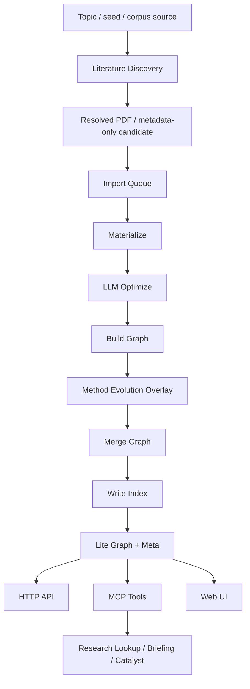

# PaperNexus as a Local-First Research Knowledge Graph

## A Current-System Technical Report in Long-Form Paper Style

Generated: 2026-05-09  
Repository: `PaperNexus`  
Branch state: `main...origin/main`  
Template reference: arXiv `2605.05242`, used as a structural and rhetorical reference only.

## Abstract

PaperNexus is a local-first research knowledge graph system for academic paper corpora. It ingests PDF or Markdown sources, materializes reusable semantic snapshots, builds a typed multilayer graph, and exposes this graph through CLI, Web UI, authenticated HTTP APIs, local stdio MCP, and remote streamable HTTP MCP. This report characterizes the current system state after a broad feature expansion that adds a PaperNexus-native literature discovery backbone, a method-evolution evidence layer, and a graph-only research intelligence interface.

We analyze the system from three perspectives: architecture, implementation delta, and operational readiness. The current working tree contains 20 modified tracked files with 1765 insertions and 147 deletions, plus 21 untracked implementation/support files before this report was added. GitNexus indexes this repository as `PaperNexus` with 263 files, 9075 symbols, 17200 relationships, and 300 execution flows. A full `npm test` run passes 329 of 329 tests. However, GitNexus change detection reports 133 changed symbols, 40 affected execution flows, and a `critical` risk level because the changes cross MCP dispatch, HTTP serving, graph construction, LLM optimization, and method-evolution graph projection. We conclude that the system is functionally coherent and strongly test-backed, but not yet release-clean without generated-doc synchronization, focused review of critical execution paths, and small live smoke tests for discovery and method evidence.

## 1. Introduction

Research automation systems often fail at the boundary between literature acquisition, local evidence management, and downstream reasoning. PaperNexus addresses this boundary by making the corpus graph the central artifact. Rather than treating papers as isolated documents or embedding-only records, the system maps papers into typed nodes and relationships such as `Problem`, `Method`, `Claim`, `Evidence`, `Dataset`, `Benchmark`, `Takeaway`, `IdeaFragment`, and `FutureDirection`.

The current development snapshot moves PaperNexus from a graph-backed paper analysis tool toward a more complete research intelligence substrate. The newly added pieces are not only user-facing tools; they expand the upstream and midstream contracts of the system:

1. Literature discovery now begins before local files exist. A topic can produce provider queries, merged candidates, legal full-text resolution, persisted coverage artifacts, and import queue submissions.
2. Method evolution is now represented as graph-native evidence. Citation contexts can induce typed method-to-method relationships with validation gates, exact quote requirements, temporal checks, and graph projections.
3. Research intelligence queries now operate over these graph structures without query-time LLM calls. Cross-domain evidence, method lineage, method evidence, method registry, and unified research answers are exposed through HTTP and MCP surfaces.

This report follows a long-form paper structure: we state research questions, present the system design, describe the current implementation, evaluate it against tests and graph impact analysis, and discuss limitations.

### 1.1 Research Questions

We frame the report around four practical research questions.

**RQ1. Architectural coherence:** Does the current working tree preserve the staged local-first architecture while adding discovery and method evolution?

**RQ2. Interface resolution:** Which new user or agent operations are now expressible through stable MCP/HTTP surfaces rather than ad hoc scripts or raw routes?

**RQ3. Evidence quality:** How much of the new reasoning surface is grounded in graph evidence rather than query-time generation?

**RQ4. Release readiness:** What risk remains after a passing test suite, and where should review focus next?

## 2. Background and System Setting

PaperNexus is implemented as a Node 20 ESM project with a CLI entry point at `src/cli/index.js`. Its persistent state is local-first: corpus metadata, source manifests, markdown caches, semantic snapshots, authoritative graph files, lite graph views, queue stores, and discovery artifacts live under the configured PaperNexus storage layout.

The maintained architecture is organized into five layers.

| Layer | Current responsibility |
| --- | --- |
| Source layer | Raw `.pdf`, `.md`, and `.markdown` corpus files plus uploaded import-task files. |
| Snapshot layer | Markdown cache, source manifest, semantic snapshots, parser metadata, and LLM reuse signatures. |
| Graph layer | Authoritative corpus graph, lite read projection, graph meta, derived domain/method structures. |
| Queue and worker layer | Import queue, enhancement queue, authoritative sync queue, retry/quarantine/recovery logic. |
| Interface layer | CLI, browser UI, authenticated HTTP API, local stdio MCP, remote HTTP MCP, Python wrapper scripts. |

The design priority is reuse before rebuild. Long-running paper analysis should not be invalidated by every later-stage change. The pipeline therefore separates raw parsing, semantic enrichment, graph construction, canonicalization, and commit.

```text
raw sources
  -> materialize
  -> llm-optimize
  -> build-graph
  -> merge-graph
  -> write-index
```

This split is important for the current change set. Literature discovery enters before `materialize`; method evolution enters during graph construction; research intelligence exits through graph query surfaces after commit. The new work therefore touches both ends of the pipeline while relying on the same central graph contract.

## 3. System Overview

Figure 1 summarizes the current system as a staged graph engine with a new discovery front-end and a richer research intelligence back-end.



The central technical pattern is graph-mediated interaction. Inputs are normalized into graph-compatible state, and outputs are returned as graph-backed evidence, traversals, or reports.

### 3.1 Corpus and Snapshot Contract

The existing source-to-snapshot contract remains intact. A corpus source is converted to markdown when needed, associated with a manifest entry, and materialized as a semantic paper snapshot. LLM optimization can enrich these snapshots without reparsing PDFs. This supports cache reuse, dirty-only refresh, and import queue recovery.

### 3.2 Graph Contract

The graph schema is now expanded with method-evolution relationships. New method edge types include:

```text
EXTENDS_METHOD
IMPROVES_METHOD
REPLACES_METHOD
ADAPTS_METHOD
USES_COMPONENT_METHOD
COMPARES_METHOD
BACKGROUND_METHOD
VARIANT_OF
SPECIALIZES
COMPONENT_OF
```

The relationship compatibility matrix has been updated so these edges connect `Method` nodes to `Method` nodes. Strong method evolution relationships represent substantive claims such as improvement, extension, adaptation, replacement, or component use. Contextual relationships such as comparison and background citation are tracked separately.

### 3.3 Interface Contract

PaperNexus exposes a layered interface strategy:

| Interface | Best use |
| --- | --- |
| CLI | Local operator workflows such as init, analyze, staged rebuilds, backup, and serve. |
| Web UI | Human inspection of corpus state, graph summaries, overlays, and runtime configuration. |
| HTTP API | Authenticated browser/server payload routes and route-level testing. |
| Local MCP | Local agent access over stdio. |
| Remote HTTP MCP | Preferred live automation control plane. |
| Python wrappers | Agent-friendly remote task submission, queue inspection, and research chain calls. |

The current direction is to make remote HTTP MCP the stable automation surface. Raw `/api/*` routes remain useful and tested, but MCP tools are the safer contract for agents.

## 4. Current Implementation Delta

Table 1 lists the main implementation areas in the current working tree.

| Area | Files | Status |
| --- | --- | --- |
| Literature discovery | `src/core/discovery/*`, `src/mcp/tool-literature-discovery.js` | Implemented in working tree, uncommitted. |
| Method evolution validation | `src/core/ingestion/method-evolution-overlay.js`, `method-evolution-validator.js` | Implemented and test-backed. |
| Method evolution benchmark | `src/core/graph/method-evolution-benchmark.js`, fixture/test files | Implemented and test-backed. |
| Research intelligence | `src/core/graph/research-intelligence.js`, `src/mcp/tool-research-lookup.js`, `src/server/api.js` | Expanded with graph-only evidence paths. |
| Graph schema/docs | `schema.js`, `rules.js`, generated graph schema docs | Edge types updated. |
| Prompt signatures | `src/core/llm/prompts/*` | Added prompt-versioned config signatures. |
| License/docs | `LICENSE`, `README.md`, VitePress config | MIT-based attribution notice added. |

### 4.1 Literature Discovery

The discovery subsystem adds an upstream route from topic to importable sources. It is implemented as a first-class PaperNexus subsystem rather than a prompt-only workflow.

The core modules are:

- `query-planner.js`: infers depth, discipline, query families, and preferred venue packs.
- `providers.js`: implements OpenAlex, Semantic Scholar, Crossref, arXiv, DBLP, Europe PMC/PubMed alias, and CORE when configured.
- `merge.js`: merges candidates with strong identifier overlap, alias overlap, exact/fuzzy title evidence, author/year/venue evidence, and relation hints.
- `citation-expansion.js`: expands seed candidates through Semantic Scholar references and citations.
- `source-resolution.js`: resolves legal OA PDF sources, validates PDF headers, classifies HTML or anti-bot responses, uses Unpaywall DOI lookup, and records institutional access hints.
- `store.js`: writes `discovery.json`, `report.md`, `download-manifest.json`, and `latest.json`.
- `import-bridge.js`: submits resolved local PDFs through the existing import queue payload path.
- `workflow.js`: orchestrates planning, provider execution, merge, citation expansion, source resolution, coverage calculation, and persistence.

The MCP tool surface is:

```text
literature_discovery operations:
plan, search, resolve, run, import, status, report, list
```

The key design choice is to treat download count as an insufficient metric. The subsystem records full text, metadata-only candidates, unresolved items, institutional hints, provider failures, and coverage verdicts. This allows a user to distinguish "not found" from "found but no legal open PDF available" and from "found but not imported yet".

### 4.2 Method Evolution and Evidence

The method evolution layer converts citation contexts and method references into typed graph relationships. The implementation builds a method registry, extracts citation contexts, classifies citation semantics, validates candidates, and projects accepted relationships into the graph.

Strong method evolution edges must pass several gates:

- source and target methods must resolve
- exact quote must exist for strong edges
- quote must match the citation context
- semantic confidence must exceed the minimum threshold
- temporal direction must be known and non-reversed
- bottleneck, mechanism, tradeoff, and confidence evidence must be complete
- conflicting strong directions are blocked

The overlay persists candidates, validated edges, authoritative edges, stubs, registry diagnostics, citation-funnel diagnostics, and summary metrics. The summary includes accepted edge count, quote validation pass rate, evidence completeness rate, top bottleneck dimensions, ambiguous alias surfaces, and blocked alias surfaces.

### 4.3 Research Intelligence

The research intelligence surface now exposes graph-only answer paths. The important invariant is `queryTimeLlmCalls: 0`. The system returns evidence already present in the graph rather than synthesizing new evidence at query time.

New or expanded operations include:

| Operation | Purpose |
| --- | --- |
| `cross_domain_evidence` | Build mechanism evidence bundles across domains with evidence certificates. |
| `method_lineage` | Traverse validated method evolution relationships. |
| `method_evidence` | Inspect accepted or candidate method relationship evidence. |
| `method_registry` | Return method registry, aliases, stubs, and diagnostics from graph state. |
| `research_answer` | Route to cross-domain evidence, method lineage, or both. |

The HTTP layer exposes `POST /api/method-lineage` and `POST /api/method-evidence`. The MCP `research_lookup` tool has been expanded to include these operations plus exact paper index lookup and interdisciplinary graph operations.

## 5. Experimental Evaluation

The evaluation here is a system-status evaluation rather than a benchmark paper evaluation. It combines unit/integration tests, Git diff evidence, GitNexus graph impact analysis, and manual source inspection.

### 5.1 Test Suite

The full test command was:

```bash
npm test
```

The observed result was:

```text
tests 329
pass 329
fail 0
duration_ms 67795.570292
```

The passing suite covers:

- staged analyze/materialize/optimize/build/merge/write-index flows
- import queue operations and remote Python wrappers
- HTTP auth and graph query APIs
- local and remote MCP surfaces
- literature discovery planning, source resolution, import contract, and MCP tool listing
- method evolution overlay, validator, benchmark, lineage, and evidence lookup
- research chain and research intelligence payloads
- backup/export/unpack
- domain distance, catalyst, brainstorming, and graph postprocess behavior

### 5.2 Change Impact

GitNexus reports the following working-tree impact:

| Metric | Value |
| --- | --- |
| Changed symbols | `133` |
| Affected execution flows | `40` |
| Changed tracked files | `20` |
| Risk level | `critical` |

The primary affected flows are:

- `ServeCommand` startup, HTTP routing, worker startup, and API serving.
- `HandleMcpHttpRequest` and `ExecuteTool` MCP dispatch.
- `ExecuteResearchLookupTool` remote graph lookup.
- `BuildGraphFromSemanticPapers` method evolution overlay integration.
- `EnrichMaterializedSourcesWithOllama` LLM optimization and prompt signature reuse.

The passing test suite gives strong evidence that the current implementation is coherent. The `critical` GitNexus risk means the blast radius is broad enough that review should focus on integration contracts, not only local correctness.

### 5.3 Operational Warning

One warning appeared during the test run: Docling warmup failed because `/home/researcher/.cache/docling/models` was not a valid model artifacts path in this environment. This did not fail tests, but it is a real runtime configuration risk if imports rely on Docling warmup on this machine.

## 6. Results

We answer the research questions from Section 1.1.

**RQ1. Architectural coherence.** The current change set preserves the staged graph architecture. Discovery feeds the import queue; method evolution attaches during graph construction; research intelligence consumes lite graph state. The core pipeline remains cache-first and staged.

**RQ2. Interface resolution.** The system now exposes upstream discovery and downstream method evidence through typed MCP/HTTP operations. This reduces reliance on one-off scripts and raw API route invention. The most important new tool is `literature_discovery`; the most important expanded tool is `research_lookup`.

**RQ3. Evidence quality.** The method evidence and research answer paths are graph-only at query time. They rely on persisted citation contexts, exact quotes, validation gates, and graph relationships. This is stronger than prompt-only answer synthesis, but it depends on the quality and completeness of the ingestion-time extraction.

**RQ4. Release readiness.** The system is test-passing but not low-risk. The change set is broad, generated MCP reference docs appear stale relative to `src/mcp/tools.js`, several discovery roadmap items are still pending, and the Docling runtime config warning should be addressed if local imports require it.

## 7. Limitations

The current system has several known limitations.

First, metadata-only discovery candidates are persisted in discovery artifacts but are not automatically materialized as graph paper nodes. Graph-level research tools operate on papers that have passed through import/materialization.

Second, literature discovery provider coverage is still incomplete. OpenReview, Papers with Code, DataCite, OpenAIRE, BASE, HAL, Zenodo, bioRxiv, medRxiv, SSRN, OSF, and Chinese scholarship providers remain roadmap items.

Third, discovery screening is not yet a first-class standalone operation. The current system can plan, search, resolve, run, import, list, status, and report, but systematic-review-style include/exclude tables are not yet implemented.

Fourth, version relations are not yet fully materialized into graph-level paper relations. The merge layer records relation hints, but explicit relations such as preprint-of, extended-by, version-of, and artifact-for remain future work.

Fifth, generated reference documentation has drift. The source MCP tool list includes `literature_discovery`, but the generated MCP reference page inspected during this report did not yet include it.

Sixth, GitNexus impact is critical. Even though tests pass, the modified symbols sit on core execution paths. A release should include focused review and live smoke tests.

## 8. Recommended Release Checklist

Before treating this state as release-ready, the following checklist should be completed:

1. Run `npm run docs:generate` and verify generated MCP docs include `literature_discovery` plus the expanded `research_lookup` operations.
2. Review the critical GitNexus flows: `executeTool`, `serveCommand`, `executeResearchLookupTool`, `buildMethodEvolutionOverlay`, and LLM prompt signature reuse.
3. Run a small `literature_discovery plan/search` smoke test with `allowDownloads: false`.
4. Run one controlled `literature_discovery run` against a temporary corpus with low `maxCandidates` and low `maxDownloads`.
5. Verify that `literature_discovery import` submits only resolved local full-text sources and preserves metadata-only records.
6. Exercise `method_lineage`, `method_evidence`, `method_registry`, and `research_answer` through remote HTTP MCP.
7. Fix or document the local Docling artifacts path if parser warmup is expected to succeed.
8. Stage untracked subsystem files explicitly. The current implementation depends on untracked source and test files.

## 9. Conclusion

PaperNexus is currently in a strong feature-development state. It has moved beyond corpus-local graph search toward a fuller research intelligence system with topic-level literature discovery, graph-native method evolution, and evidence-grounded query surfaces. The full test suite passes, and the new subsystems follow the central staged architecture instead of bypassing it.

The main conclusion is therefore two-sided. Functionally, the system is coherent and significantly more capable than the previous baseline. Operationally, it remains a broad, high-blast-radius change set. The next engineering step should not be more feature growth; it should be contract stabilization, generated documentation synchronization, targeted manual smoke testing, and review of the GitNexus-critical execution paths.

## References

[1] arXiv:2605.05242. Used as the structural and rhetorical reference for this long-form report style. https://arxiv.org/pdf/2605.05242

[2] PaperNexus repository docs inspected from the local working tree: `README.md`, `docs/overview/index.md`, `docs/pipeline/index.md`, `docs/graph/index.md`, `docs/interfaces/index.md`, and `docs/superpowers/specs/2026-05-09-literature-discovery-coverage-design.md`.

## Appendix A. Current Working Tree Summary

Tracked modified files include:

```text
README.md
docs/.vitepress/config.mjs
docs/reference/generated/graph-schema.md
package-lock.json
package.json
src/core/graph/research-intelligence.js
src/core/graph/rules.js
src/core/graph/schema.js
src/core/ingestion/method-evolution-overlay.js
src/core/ingestion/pipeline.js
src/mcp/core.js
src/mcp/tool-research-lookup.js
src/mcp/tools.js
src/server/api.js
src/server/http.js
test/materialize-optimize.test.js
test/mcp.test.js
test/method-evolution-overlay.test.js
test/research-chain-api.test.js
test/research-intelligence.test.js
```

Untracked implementation/support files before this report was added include:

```text
LICENSE
docs/superpowers/specs/2026-05-09-literature-discovery-coverage-design.md
src/core/discovery/*
src/core/graph/method-evolution-benchmark.js
src/core/ingestion/method-evolution-validator.js
src/core/llm/prompts/*
src/mcp/tool-literature-discovery.js
test/fixtures/method-evolution-benchmark-v1-mini.json
test/literature-discovery.test.js
test/method-evolution-benchmark.test.js
test/method-evolution-validator.test.js
```

## Appendix B. Discovery Coverage Model

The current discovery coverage report distinguishes:

- raw candidates
- merged papers
- strong identity candidates
- resolved full text
- metadata-only candidates
- imported sources
- provider failure summary
- provider agreement distribution
- query coverage
- citation expansion coverage
- coverage verdict

This is a stronger operational model than reporting only downloads. It makes coverage gaps inspectable.

## Appendix C. Method Evolution Validation Gates

Strong method evolution edges are blocked when any of the following conditions are present:

- missing source method
- missing target method
- target method is only a stub
- missing method evolution type
- missing exact quote
- missing citation context
- quote does not exactly match context
- low semantic confidence
- missing temporal year
- reverse temporal direction
- incomplete bottleneck evidence
- incomplete mechanism evidence
- incomplete tradeoff evidence
- missing confidence
- conflicting strong method direction

These gates are useful because method evolution is a high-risk semantic layer. False positives here would pollute downstream lineage and evidence queries.
