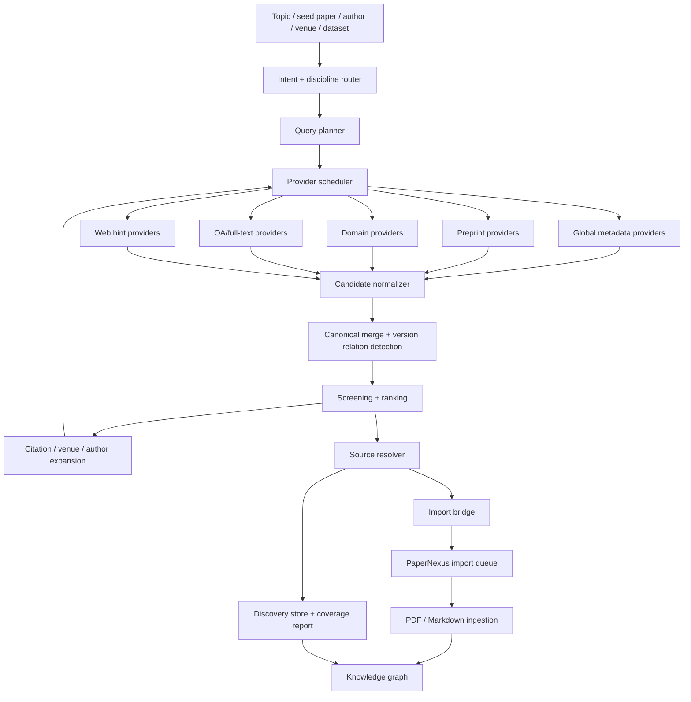

# Literature Discovery Coverage Design

## Goal

Add a PaperNexus-native automatic literature discovery layer that can:

- start from a topic, question, seed paper, author, venue, dataset, or related-work paragraph
- discover candidate papers across broad and discipline-specific sources
- resolve legal open full text when available
- retain important metadata-only papers when full text is not legally available
- submit resolved sources through the existing PaperNexus import queue
- expose reproducible provenance so coverage gaps are explainable

This should be a discovery and import backbone, not a prompt-only skill.

## Current Implementation Status

As of 2026-05-09, the PaperNexus-native discovery/import backbone is implemented, but this document still tracks both the implemented state and the broader coverage roadmap.

Implemented:

- MCP tool: `literature_discovery`.
- Operations: `plan`, `search`, `resolve`, `run`, `import`, `status`, `report`, `list`.
- Default search providers: OpenAlex, Semantic Scholar, Crossref, arXiv.
- Conditional/domain providers: DBLP for computer-science plans, Europe PMC/PubMed alias for biomedicine plans, CORE when `CORE_API_KEY` or `coreApiKey` is configured.
- Source resolution: arXiv direct PDF, PMCID/PMC PDF URL, provider PDF hints, Unpaywall DOI lookup, CORE download URLs, PDF header validation, HTML/non-PDF classification, anti-bot/access-control classification, and institutional access hints.
- Citation expansion: Semantic Scholar backward references and forward citations, explicit `citationExpansion: true`, and default-on for `depth: deep`.
- Venue-aware ranking evidence: venue alias/family/pack matching for CS, biomed, and general science venues.
- Multi-evidence deduplication: strong identifier overlap, non-title alias overlap, exact title with safe secondary evidence, fuzzy title with author/venue/year evidence, and relation hints for likely versions that should not be hard-merged.
- Run artifacts: `discovery.json`, `report.md`, `download-manifest.json`, and `latest.json` under `.papernexus/discovery/`.
- Import bridge: resolved local PDFs are submitted through the existing import queue payload path.
- Tests: `test/literature-discovery.test.js` plus MCP coverage in `test/mcp.test.js` and `test/mcp-http.test.js`.

Not yet implemented:

- Standalone `screen` operation.
- Split provider adapter files under `providers/*.js`; current adapters are centralized in `providers.js`.
- `provider-contract.js`, `discipline-profiles.js`, standalone `screening.js`, and standalone `coverage-report.js`.
- HTML/JATS/XML/publisher XML import as first-class source kinds.
- OpenReview, Papers with Code, DataCite, OpenAIRE, BASE, HAL, Zenodo, bioRxiv, medRxiv, SSRN, OSF, CNKI/Wanfang/VIP, and similar roadmap providers.
- Co-citation, bibliographic coupling, author expansion, dataset/benchmark expansion, graph-level version relation materialization, and systematic review screening tables.

## Current PaperNexus System Surface

The discovery layer should be understood as the upstream entry point into the existing PaperNexus corpus, import, and graph-analysis system. Current MCP-visible capabilities are:

| Area | Tools / Operations | Current role in literature discovery |
| --- | --- | --- |
| Corpus inventory | `list_corpora`, `corpus_status`, `corpus_sources` | Pick the target corpus, inspect indexed status, and reconcile which files/papers are already materialized before importing new PDFs. |
| Discovery and source resolution | `literature_discovery` with `plan`, `search`, `resolve`, `run`, `import`, `status`, `report`, `list` | Topic-to-candidates, multi-provider merge, OA/full-text resolution, manifest persistence, and optional import submission. |
| Import queue | `import_workflow` with `submit`, `list`, `status`, `progress`, `queue_progress`, `log`, `wait` | Submit staged PDFs or user-provided local files, monitor parsing/materialization, and verify completion. |
| Core graph search | `query`, `context`, `impact`, `ideas`, `brainstorm` | Analyze imported papers as graph nodes across problems, methods, claims, findings, limitations, assumptions, evidence, datasets, benchmarks, metrics, and future directions. |
| Unified graph lookup | `research_lookup` with `query`, `context`, `impact`, `ideas`, `brainstorm`, `paper_index`, `domain_distance`, `extract_takeaways`, `interdisciplinary_potential`, `cross_domain_evidence`, `method_lineage`, `method_evidence`, `method_registry`, `research_answer` | HTTP-oriented wrapper for graph search, exact paper lookup by identifiers, interdisciplinary evidence, method-evolution analysis, and answer synthesis. |
| Briefing chains | `research_briefing` with `path_trace`, `evidence_chain`, `reflection_chain`, `theory_brief`, `storyline_brief`, `research_brief`, `brainstorm_brief`, `paper_enhancement` | Build structured narrative and evidence reports after papers have been materialized into the graph. |
| Ideation | `idea_catalyst` | Produce challenge-aware interdisciplinary idea fragments or staged packet bundles from graph evidence. |
| Graph maintenance | `mutate_graph`, `refresh_corpus`, `refresh_paper_graph` | Preview/apply schema-aware graph edits, refresh the corpus incrementally, or reprocess one paper/duplicate group. |
| MCP resources | `papernexus://corpora`, `papernexus://corpus/{name}/context`, `/domain-taxonomy`, `/problems`, `/claims`, `/findings`, `/methods`, `/benchmarks`, `/limitations`, `/assumptions`, `/futures` | Lightweight read-only views for corpus status, domain taxonomy, and typed graph node lists. |
| MCP prompts | `survey_literature`, `trace_claim`, `generate_research_ideas`, `brainstorm_topic` | Reusable workflows that combine corpus context, search, context/impact, ideas, and brainstorming. |

End-to-end intended flow:

1. Use `literature_discovery plan` to inspect deterministic query families and inferred discipline.
2. Use `literature_discovery run` to retrieve, merge, resolve, stage legal PDFs, and persist artifacts.
3. Use `literature_discovery import` or `run` with `importResolved: true` to submit resolved local PDFs.
4. Use `import_workflow queue_progress`, `status`, `log`, or `wait` to monitor ingestion.
5. Use `corpus_sources` or `research_lookup paper_index` to confirm the imported paper identity.
6. Use `query`, `context`, `impact`, `research_lookup`, `research_briefing`, and `idea_catalyst` for graph-level literature analysis.
7. Use `refresh_paper_graph` if one imported paper needs re-materialization, or `refresh_corpus` when the corpus root changed externally.

Important current boundary: discovery manifests retain metadata-only papers, access hints, skipped downloads, and unresolved records, but metadata-only discovery candidates are not yet automatically materialized as graph paper nodes. Graph-level tools operate on sources that have passed through the import/materialization path.

## Current Fit

PaperNexus already has the downstream ingestion path:

- `import_workflow` can submit files into the import queue.
- PDF and Markdown parsing can materialize papers into the graph.
- import submission requires a precise paper identifier for uploaded or server-staged files.
- identifier enrichment already knows OpenAlex, Crossref, and arXiv, but only after a local source exists.

Before the current discovery work, the missing layer was upstream:

1. topic-to-query planning
2. multi-provider candidate retrieval
3. canonical merge and version reasoning
4. OA/full-text resolution
5. metadata-only retention
6. batch bridge into `import_workflow`

Current implementation covers items 1, 2, 4, 5, and 6, and implements multi-evidence canonical merge plus discovery-time relation hints. Deeper graph-level version relation materialization is still planned.

OpenClaw Research already has most of this shape in `tools/research30/`. It should be used as the implementation blueprint, but PaperNexus needs stricter corpus persistence, graph-aware identity, and import-queue integration.

## Main Shortcomings In The Initial Plan

### 1. Provider Count Is Not The Same As Coverage

Adding more APIs improves recall only if each provider has a clear role. Otherwise the system gets many duplicates, rate-limit failures, and low-quality candidates.

Use provider tiers:

| Tier | Purpose | Examples |
| --- | --- | --- |
| Global metadata | broad recall and identifier completion | OpenAlex, Semantic Scholar, Crossref, DataCite |
| Preprint | newest work and easy OA PDF | arXiv, bioRxiv, medRxiv, ChemRxiv, SSRN, OSF Preprints, PsyArXiv, SocArXiv |
| OA/full text | legal PDF or full-text recovery | Unpaywall, PubMed Central, Europe PMC, CORE, OpenAIRE, DOAJ, BASE, HAL, Zenodo |
| Domain indexes | discipline-specific recall and ranking | DBLP, OpenReview, PubMed, ClinicalTrials, NASA ADS, INSPIRE HEP, RePEc, ERIC |
| Web hints | discovery hints, not authoritative identity | Google Scholar via CDP, CNKI via CDP, Exa/search engine, publisher pages |
| Research artifacts | code, data, protocols, reproducibility | Papers with Code, GitHub, Hugging Face, Zenodo, Figshare, Dataverse, Dryad |

### 2. Download Success Is The Wrong Primary Metric

The primary metric should be coverage, not download count.

A good run should distinguish:

- discovered and imported full text
- discovered but metadata-only
- discovered but needs institution
- discovered but blocked by bot protection
- discovered but no legal open full text found
- duplicate or alternate version
- rejected during screening

Important DOI-backed or venue-confirmed papers must not disappear just because no PDF was downloaded.

### 3. Version Relations Need First-Class Modeling

arXiv preprint, conference DOI, journal extension, erratum, dataset paper, and revised version may be related but not identical.

PaperNexus should not flatten all near-duplicates into one undifferentiated record. It needs these relations:

- `same_work`: same paper identity across sources
- `preprint_of`: arXiv/bioRxiv version of a peer-reviewed work
- `extended_by`: journal or long version extends a conference paper
- `version_of`: same preprint family, different version
- `dataset_or_code_for`: artifact linked to the paper
- `cites` and `cited_by`: citation expansion evidence

Canonical identity should still prioritize strong identifiers, but merge logic should keep conflicting strong identifiers as evidence that a relation may be needed instead of a hard merge.

### 4. Search Needs Snowballing, Not Only Keyword Queries

Topic keyword search misses seminal papers, papers using older terminology, and adjacent field terms.

Discovery should combine:

1. direct query search
2. expanded query families
3. controlled vocabulary expansion
4. backward citation expansion
5. forward citation expansion
6. co-citation and bibliographic coupling
7. venue and author expansion
8. dataset, benchmark, and code expansion

The run should record each expansion route so users can audit why a paper appeared.

### 5. Discipline Routing Needs To Affect More Than Provider Choice

Each discipline needs different query terms, ranking, inclusion criteria, and metadata fields.

Examples:

| Discipline | Query support | Ranking support | Extra metadata |
| --- | --- | --- | --- |
| CS/AI | ACM CCS, task names, benchmarks, datasets | venue, recency, citation, code | code URL, dataset, benchmark |
| Biomedicine | MeSH, PICO, drug synonyms | evidence type, journal, trial phase | PMID, PMCID, MeSH, population, intervention |
| Physics/math | arXiv category, MSC, theorem/problem names | venue/archive, field conventions | MSC, arXiv category, experiment |
| Chemistry/materials | CAS/material synonyms, reaction terms | journal, method, material system | compound/material, method, license |
| Econ/social science | JEL, geography, policy terms | working paper vs journal, method | JEL, data source, geography |
| Humanities/law | multilingual names, books, archives | source authority, edition | ISBN, edition, archive/source |
| Chinese scholarship | Chinese synonyms, translated titles | CNKI/Wanfang/VIP metadata | CNKI URL, journal, download/citation counts |

### 6. Full Text Is Not Always PDF

Some legal full text is HTML, JATS XML, publisher XML, supplementary PDF, or repository text.

The resolver should support `sourceKind` values beyond `pdf`:

- `pdf`
- `html`
- `jats_xml`
- `publisher_xml`
- `markdown`
- `supplement`
- `metadata_only`

PaperNexus ingestion can still begin with PDF/Markdown for MVP, but the discovery manifest should not erase non-PDF full-text evidence.

### 7. Reproducibility Needs Run Artifacts

Every discovery run should persist:

- user input and normalized topic
- selected discipline profile
- query plan and search strings
- provider list and provider versions/options
- raw provider result snapshots or stable summaries
- merge decisions and identity aliases
- screening decisions and exclusion reasons
- source-resolution attempts
- import task ids
- final coverage report

Without this, users cannot tell whether a literature map is incomplete because the topic is sparse, a provider failed, the query was weak, or legal full text was unavailable.

## Optimized Architecture



## PaperNexus Module Status

Add `src/core/discovery/`:

| Module | Status | Responsibility |
| --- | --- |
| `query-planner.js` | Implemented | deterministic query families, discipline inference, search strings, and preferred venue packs |
| `providers.js` | Implemented | provider registry, config resolution, provider adapters, provider response normalization |
| `merge.js` | Implemented | multi-evidence paper deduplication, relation hints, provider agreement, scoring, venue pack influence |
| `venue-registry.js` | Implemented | venue aliases, venue families, and domain venue packs |
| `citation-expansion.js` | Implemented | Semantic Scholar backward and forward citation expansion |
| `source-resolution.js` | Implemented | legal OA PDF resolution, local staging, Unpaywall lookup, PDF validation, institutional hints |
| `download-manifest.js` | Implemented | per-candidate download manifest rows and status counts |
| `store.js` | Implemented | per-corpus run artifacts, latest pointer, Markdown report persistence |
| `workflow.js` | Implemented | end-to-end orchestration: plan, provider execution, merge, citation expansion, resolution, coverage, and persistence |
| `import-bridge.js` | Implemented | submit resolved files to existing `import_workflow` payload path |
| `provider-contract.js` | Not implemented | common provider interface, rate-limit metadata, error taxonomy |
| `discipline-profiles.js` | Not implemented | richer discipline routing, controlled vocabulary hints, ranking knobs |
| `providers/*.js` | Not implemented | split provider adapters; currently centralized in `providers.js` |
| `normalize.js` | Not implemented | separate normalizer; normalization currently lives in `providers.js` |
| `screening.js` | Not implemented | include/exclude/maybe decisions, scoring, reason codes |
| `coverage-report.js` | Not implemented | separate report module; coverage JSON lives in `workflow.js`, Markdown rendering in `store.js` |

MCP integration:

| Module | Status | Responsibility |
| --- | --- | --- |
| `src/mcp/tool-literature-discovery.js` | Implemented | normalize MCP args, resolve corpus, dispatch operations, apply import results, and save updated runs |
| `src/mcp/tools.js` | Implemented | expose the `literature_discovery` schema and all current parameters |
| `src/mcp/core.js` | Implemented | dispatch `literature_discovery` through the MCP server alongside other PaperNexus tools |
| `test/literature-discovery.test.js` | Implemented | deterministic coverage for planner, providers, resolver, manifest, import bridge assumptions, CORE, DBLP, Europe PMC, citation expansion, and MCP listing |

Expose a new MCP tool:

```json
{
  "name": "literature_discovery",
  "operations": ["plan", "search", "resolve", "run", "import", "status", "report", "list"]
}
```

Preferred high-level call:

```json
{
  "operation": "run",
  "corpus": "my-corpus",
  "topic": "multi-agent reinforcement learning for traffic signal control",
  "depth": "default",
  "discipline": "auto",
  "importResolved": true,
  "maxImported": 20,
  "citationExpansion": false,
  "maxCitationSeeds": 3,
  "maxCitationsPerSeed": 5,
  "coreApiKey": ""
}
```

Current MCP parameters also include `providers`, `maxQueries`, `maxResultsPerQuery`, `maxCandidates`, `maxDownloads`, `allowDownloads`, `mailto`, `timeoutMs`, `institutionalResolverBaseUrl`, `institutionalAccessMode`, `runId`, `limit`, and `persist`.

Current operation semantics:

| Operation | Resolves sources | Persists run | Submits imports | Output |
| --- | --- | --- | --- | --- |
| `plan` | No | No | No | Query plan only; no corpus required. |
| `search` | No | Yes unless `persist: false` | Only if `importResolved: true`, but there will normally be no resolved local PDFs. | Discovery run with metadata-only source states. |
| `resolve` | Yes unless `resolveSources: false` | Yes unless `persist: false` | Only if `importResolved: true`. | Discovery run with source-resolution attempts and download manifest. |
| `run` | Yes unless `resolveSources: false` | Yes unless `persist: false` | If `importResolved: true`. | Full discovery run, coverage, artifacts, and optional import summary. |
| `import` | Yes unless `resolveSources: false` | Yes unless `persist: false` | Yes. | Full run plus `importSummary` and per-candidate import status. |
| `status` | No | No | No | Latest run or requested `runId` JSON. |
| `report` | No | No | No | Same current JSON payload as `status`; Markdown report is persisted as an artifact. |
| `list` | No | No | No | Recent persisted runs with coverage summaries. |

Current persisted artifact layout:

```text
.papernexus/
  discovery/
    latest.json
    runs/
      {runId}/
        discovery.json
        report.md
        download-manifest.json
    staging/
      pdf/
        {safe-canonical-id}.pdf
```

Artifact roles:

- `discovery.json`: complete run contract, including plan, providers, query results, candidates, resolution summary, citation expansion summary, access policy, coverage, and artifact paths.
- `report.md`: human-readable coverage summary and top-candidate table.
- `download-manifest.json`: Academic-Search-style download manifest with identifiers, PDF URL, `full_text_status`, `download_status`, skip/failure reason, local path, and institutional access hints.
- `latest.json`: pointer to the latest persisted run for `status`/`report` calls without `runId`.
- `staging/pdf`: local PDFs that passed binary PDF validation and can be submitted to `import_workflow`.

## Deduplication And Version Hints

Discovery merges provider results into canonical paper candidates before source resolution and import. The dedupe policy is intentionally conservative: it should remove true cross-provider duplicates, but it should not flatten preprints, conference papers, journal extensions, errata, datasets, or strong-ID conflicts into one record unless the evidence is strong enough.

Current hard-merge rules:

| Rule | Merge? | Reason code | Notes |
| --- | --- | --- | --- |
| Same strong identifier | Yes | `strong_identifier_overlap` | DOI, arXiv ID, PMID, or PMCID overlap. |
| Same non-title alias without identifier conflict | Yes | `identity_alias_overlap` | Handles explicit identity aliases and normalized identifier aliases. |
| Exact title where at least one side is title-only | Yes | `exact_title_with_secondary_evidence` | Allows metadata-only/title-only results to attach to stronger records. |
| Exact title where both sides have strong identifiers | Yes only with safe secondary evidence | `exact_title_with_secondary_evidence` | Requires compatible year and overlapping author or venue evidence. |
| Fuzzy title match | Yes only with safe secondary evidence | `fuzzy_title_with_secondary_evidence` | Requires title similarity >= `0.86`, compatible year, and author or venue overlap. |
| Same title but conflicting same-field strong identifiers | No | relation hint only | Example: two different DOI values. |
| Similar title but insufficient author/venue/year evidence | No | relation hint or separate record | Prevents accidental merge of surveys, follow-up papers, and similarly named papers. |

Secondary evidence:

- Year compatibility: either year is missing, or the absolute year delta is <= 1 for hard merge.
- Author overlap: normalized author keys share at least one surname/key.
- Venue compatibility: same venue family, high venue-name similarity, or overlapping venue pack hit.
- Title similarity: token-set Jaccard with light singular/plural normalization, plus the existing normalized-title comparison.

Current candidate-level dedupe fields:

- `providers`: merged provider names.
- `providerAgreementCount`: number of providers in the merged candidate.
- `providerRecords`: per-provider source records retained after merge.
- `dedupeEvidence`: merge decisions with reason, confidence, provider, candidate id, and title similarity.
- `conflicts`: same-field identifier conflicts when a merge is allowed through stronger evidence.
- `relations`: discovery-time relation hints for near matches that were not hard-merged.

Current relation hint types:

- `preprint_of`: this candidate appears to be a preprint of another candidate.
- `has_preprint`: this candidate appears to have a related preprint candidate.
- `version_of`: title/author evidence suggests a version relation across years.
- `same_work_candidate`: near-match evidence exists, but there is not enough confidence for hard merge.

Relation hints are not yet graph edges. They are persisted in `discovery.json` so later work can materialize them into graph relationships after metadata-only paper nodes exist.

## Candidate Schema

Current discovery candidates carry paper identity, retrieval provenance, ranking evidence, screening hints, source resolution state, and optional import state. The current implementation uses mostly flat fields rather than the nested target schema originally proposed.

```json
{
  "canonicalId": "doi:10.xxxx/yyyy",
  "identityConfidence": "strong",
  "identityAliases": ["doi:10.xxxx/yyyy", "arxiv:2401.12345"],
  "title": "",
  "authors": [],
  "year": 2026,
  "publicationDate": "2026-05-01",
  "venue": "",
  "publicationType": "journal-article",
  "abstract": "",
  "venueFamily": "",
  "venueType": "",
  "venuePackHits": ["ml-core"],
  "venueAliasesMatched": ["NeurIPS"],
  "identifiers": {
    "doi": "",
    "arxivId": "",
    "pmid": "",
    "pmcid": "",
    "isbn": "",
    "issn": ""
  },
  "citationCount": null,
  "providerAgreementCount": 2,
  "selectionScore": 0.0,
  "openAccessStatus": "green",
  "license": "cc-by",
  "bestOaUrl": "",
  "pdfUrl": "",
  "landingPageUrl": "",
  "providers": ["openalex", "semantic_scholar"],
  "providerRecords": [],
  "dedupeEvidence": [
    {
      "provider": "semantic_scholar",
      "candidateId": "semantic_scholar:abc123",
      "reason": "fuzzy_title_with_secondary_evidence",
      "confidence": "probable",
      "titleSimilarity": 0.91
    }
  ],
  "conflicts": {},
  "relations": [
    {
      "type": "preprint_of",
      "targetCanonicalId": "doi:10.xxxx/yyyy",
      "targetTitle": "",
      "evidence": {
        "titleSimilarity": 0.88,
        "yearDelta": 1,
        "authorOverlap": true,
        "venueCompatible": false,
        "strongIdentifierConflict": false
      }
    }
  ],
  "retrievalEvidence": [],
  "source": {
    "sourceKind": "pdf",
    "sourcePath": "",
    "sourceProvider": "unpaywall",
    "contentSha256": "",
    "sourceId": "",
    "resolutionStatus": "fulltext_ready",
    "fullTextStatus": "open_pdf",
    "downloadStatus": "downloaded",
    "downloadError": null,
    "localPdfPath": "",
    "pdfUrl": "",
    "resolutionAttempts": [],
    "institutionalAccessHints": []
  },
  "screening": {
    "decision": "include",
    "reason": "strong paper identity"
  },
  "import": {
    "taskId": null,
    "status": "not_submitted"
  }
}
```

Target extensions still needed: nested metric/open-access blocks, graph-level relation materialization (`same_work`, `preprint_of`, `extended_by`, `version_of`, `dataset_or_code_for`, `cites`, `cited_by`), richer screening decisions, and non-PDF `sourceKind` ingestion.

## Provider Expansion Plan

### Implemented Now

- OpenAlex: broad metadata, citation count, OA hints, concepts, DOI/PMID/PMCID/arXiv aliases.
- Semantic Scholar: CS/AI-oriented metadata, citations, references, `openAccessPdf`, and citation expansion.
- Crossref: DOI, ISSN, ISBN, publication metadata.
- arXiv: preprints and direct PDF URLs.
- Europe PMC: biomedical metadata, PMID/PMCID/DOI aliases, PMC PDF hints, and full-text URL hints.
- PubMed: implemented as an alias to the Europe PMC adapter.
- DBLP: CS venue/author metadata and DOI/landing-page hints.
- CORE: repository metadata and download URLs when `CORE_API_KEY` or `coreApiKey` is available; otherwise records an explicit missing-credentials provider failure.
- Unpaywall: implemented in source resolution, not as a search provider.

Provider names accepted by the MCP schema may include future adapters such as `openreview`, `papers_with_code`, and `datacite`, but those currently return `provider-not-implemented` until fetchers are added.

### P0 Default Broad Coverage

Use these first because they are API-first and align with PaperNexus identifier requirements:

- OpenAlex: broad metadata, citation count, OA hints, concepts
- Semantic Scholar: CS/AI coverage, citations, references, `openAccessPdf`
- Crossref: DOI, ISSN, ISBN, publication metadata
- arXiv: preprints and PDF
- Unpaywall: DOI to legal OA/full-text status during source resolution

### P1 High-Value Domain Coverage

- PubMed and PubMed Central for biomedical papers and PMCID full text
- Europe PMC for biomedical OA recovery
- bioRxiv and medRxiv for biomedical preprints
- DBLP for CS venue/author metadata
- OpenReview for ML conference submissions and reviews
- Papers with Code for code/dataset links
- CORE and OpenAIRE for repository PDF recovery
- DataCite for datasets, software, and DOI-backed research objects

### P2 Discipline-Specific And Regional Coverage

- NASA ADS and INSPIRE HEP for physics, astronomy, and HEP
- RePEc, NBER, SSRN, OSF for economics and social science
- ERIC for education
- DOAJ and DOAB for OA journal articles and books
- BASE, HAL, Zenodo, Figshare, Dataverse, Dryad for repositories and research artifacts
- CNKI, Wanfang, VIP through user-authenticated browser metadata routes only

### P3 Web Hint Layer

Use web search/CDP only as a hint layer:

- find DOI/arXiv/PMID when APIs fail
- find author manuscript PDFs
- discover official project pages, code, data, supplementary material
- inspect Google Scholar/CNKI metadata when user has access

Do not use this layer for unauthorized bulk PDF retrieval.

## Source Resolution Policy

Resolution order:

1. Existing local source already known to PaperNexus.
2. arXiv direct PDF when arXiv ID is present.
3. PubMed Central / Europe PMC full text when PMCID or eligible PMID is present.
4. Semantic Scholar `openAccessPdf`.
5. OpenAlex `best_oa_location` / `pdf_url`.
6. Unpaywall `best_oa_location.url_for_pdf`.
7. CORE/OpenAIRE/BASE/HAL/Zenodo repository PDF.
8. Publisher open PDF or HTML full text when license/access is public.
9. Author accepted manuscript discovered by web hint search.
10. Metadata-only unresolved record.

Current implementation covers steps 2 through 6 for PDF paths, CORE from step 7 when configured, PDF validation, and metadata-only unresolved records. OpenAIRE/BASE/HAL/Zenodo, publisher HTML full text import, author manuscript web hint discovery, and existing-local-source reuse are roadmap items.

Current `fullTextStatus` values:

- `open_pdf`
- `needs_institution`
- `no_open_pdf`
- `anti_bot_blocked`
- `html_not_pdf`
- `unknown`

Current source resolution is PDF/metadata-only focused. HTML returned from a PDF route is classified as `html_not_pdf`; HTML, JATS XML, publisher XML, supplements, and other non-PDF source kinds are recorded only as hints until ingestion supports them directly.

Forbidden:

- Sci-Hub, LibGen, shadow libraries
- WebVPN/CARSI/Tor or institutional access bypass automation
- CAPTCHA/Cloudflare bypass
- bulk downloading from publisher pages that require login or unclear authorization

Authorized institutional access is supported differently from bypass:

- record DOI and publisher landing-page hints for the user's campus network
- record optional OpenURL/link-resolver hints when a campus resolver URL is configured
- allow user-provided local files that were downloaded through legitimate access to enter the normal import queue
- keep the run auditable by storing `institutional_access_may_be_available` rather than pretending the source is open access
- do not store or replay cookies, session tokens, SSO credentials, CAPTCHA solutions, or proxy credentials in PaperNexus discovery artifacts

## Coverage Metrics

Every run should report:

- `candidateCount`: all raw candidates
- `mergedPaperCount`: canonical papers after merge
- `strongIdentityCount`: DOI/arXiv/PMID/PMCID/ISBN/ISSN backed papers
- `metadataOnlyCount`
- `resolvedFullTextCount`
- `importedCount`
- `providerAgreementDistribution`
- `providerFailureSummary`
- `queryCoverage`: results per query family
- `citationExpansionCoverage`: added by backward/forward expansion

Not yet implemented in the coverage object:

- `topUnresolvedImportantPapers`
- `disciplineCoverage`
- systematic screening/exclusion table

Use these verdicts:

- `weak`: one provider family only, low strong-identity ratio, or no expansion
- `usable`: multiple provider families, strong identifiers for most top results
- `strong`: broad search plus citation expansion plus clear unresolved accounting
- `systematic`: recorded search strings, criteria, screening table, and exclusion reasons

## MVP Backbone Status

The initial MVP backbone is implemented:

1. `literature_discovery run` for a topic. Implemented.
2. default providers: OpenAlex, Semantic Scholar, Crossref, arXiv; Unpaywall during resolution. Implemented.
3. candidate merge by strong identifiers, aliases, fuzzy title plus secondary evidence, and relation hints. Implemented.
4. legal PDF staging with PDF validation. Implemented.
5. metadata-only retention. Implemented.
6. batch submit resolved PDFs through the import queue with required identifiers. Implemented.
7. discovery artifacts under the corpus root. Implemented.
8. coverage report. Implemented.

After MVP is stable, add domain packs:

- `cs-ai`: DBLP implemented; OpenReview and Papers with Code planned.
- `biomed`: PubMed alias, PMC PDF hints, and Europe PMC implemented; bioRxiv and medRxiv planned.
- `repository-oa`: CORE implemented with API key; OpenAIRE, BASE, HAL, and Zenodo planned.
- citation snowballing: Semantic Scholar backward/forward expansion implemented; co-citation and bibliographic coupling planned.

## Test Strategy

Use mocked provider responses for deterministic tests:

- query planner produces stable families. Implemented.
- provider normalization maps identifiers correctly. Implemented.
- merge combines arXiv DOI and arXiv ID without duplicates. Implemented.
- merge dedupes fuzzy title variants when author/venue/year evidence is compatible. Implemented.
- merge preserves conflicting strong identities and records relation hints instead of unsafe hard merges. Implemented.
- resolver rejects HTML/error pages posing as PDF. Implemented.
- resolver classifies anti-bot/access-control failures. Implemented.
- metadata-only candidates persist. Implemented.
- import bridge sends DOI/arXiv/PMID/PMCID/ISBN/ISSN metadata. Implemented.
- coverage report flags one-provider or no-expansion runs as weak. Implemented.
- Europe PMC / PMCID PDF resolution. Implemented.
- CORE API-key gated provider behavior. Implemented.
- Semantic Scholar citation expansion. Implemented.

Still needing tests when those features are implemented:

- graph materialization of `preprint_of`, `extended_by`, and `version_of` relation hints.
- HTML/JATS/XML source ingestion.
- standalone screening and exclusion reasons.

## Open Questions

1. Should metadata-only papers become graph nodes immediately, or live in discovery manifests until full text exists?
2. Should PaperNexus expose discovery manifests in the UI before graph ingestion?
3. Should Google Scholar/CNKI CDP be a local-only assistant workflow instead of server-side PaperNexus functionality?
4. How much raw provider response should be stored for reproducibility versus disk usage?
5. Should domain packs be configured per corpus, per run, or inferred from topic every time?

## Recommended Next Direction

The native discovery backbone is now in place. The next implementation sequence should build on the current PaperNexus system rather than replacing it:

1. Add provider coverage where it most improves recall:
   - `cs-ai`: OpenReview and Papers with Code.
   - `biomed`: bioRxiv and medRxiv.
   - `repository-oa`: OpenAIRE, BASE, HAL, Zenodo.
   - `research-objects`: DataCite, Figshare, Dataverse, Dryad.
2. Split `providers.js` only after more providers are added; until then, the centralized adapter keeps tests and error handling simpler.
3. Add `provider-contract.js` to standardize provider capabilities, credential requirements, rate-limit policy, retry policy, and `provider-not-implemented` reporting.
4. Add first-class metadata-only graph materialization:
   - create lightweight paper nodes for high-confidence DOI/arXiv/PMID/PMCID candidates without full text;
   - mark them as `metadata_only`;
   - allow later PDF import to upgrade the same canonical identity rather than creating duplicates.
5. Materialize discovery-time relation hints into graph edges for preprint/venue/journal versions, dataset/code artifacts, and citation expansion evidence.
6. Add non-PDF full-text ingestion only after the PDF path remains stable:
   - HTML article text;
   - JATS XML / PMC XML;
   - publisher XML where openly licensed;
   - supplements and repository text.
7. Expose discovery artifacts through read-only MCP resources or UI panels so users can inspect unresolved important papers before graph import.
8. Add systematic-review screening mode after metadata-only materialization exists, because screening decisions should attach to durable candidate/paper identities.

The priority is broad, auditable coverage: important papers should remain visible even when PaperNexus cannot legally download a PDF.

## Reference Sources

Implementation references:

- OpenClaw Research `tools/research30/`: local broad-search implementation blueprint.
- `ustc-ai4science/academic-search`: skill-level platform routing, metadata schema, OA PDF manifest, and full-text status taxonomy.
- `openags/paper-search-mcp`: broad MCP implementation reference; use only OA/legal retrieval paths.

Official provider docs to use when implementing adapters:

- OpenAlex Works API: `https://docs.openalex.org/api-entities/works`
- Semantic Scholar Graph API: `https://www.semanticscholar.org/product/api`
- Crossref REST API: `https://www.crossref.org/documentation/retrieve-metadata/rest-api/`
- arXiv API: `https://info.arxiv.org/help/api/`
- Unpaywall API/data format: `https://unpaywall.org/products/api`
- NCBI E-utilities: `https://www.ncbi.nlm.nih.gov/books/NBK25501/`
- Europe PMC REST API: `https://europepmc.org/RestfulWebService`
- bioRxiv/medRxiv API: `https://api.biorxiv.org/`
- CORE API: `https://core.ac.uk/services/api`
- OpenAIRE APIs: `https://graph.openaire.eu/develop/api.html`
- DOAJ API: `https://doaj.org/api`
- DataCite REST API: `https://support.datacite.org/docs/api`
